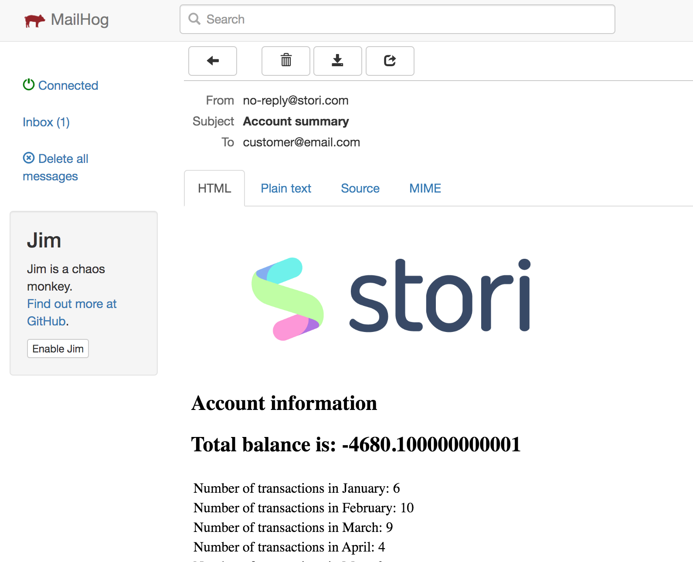

# Stori Software Engineer


**This app is using Django 4.0.4 and Python 3.10.4**:


## Table of contents
- [Running this app](#running-this-app)
- [Files of interest](#files-of-interest)
  - [`.env`](#env)
  - [`run`](#run)


## Running this app

You'll need to have [Docker installed](https://docs.docker.com/get-docker/).
It's available on Windows, macOS and most distros of Linux. If you're new to
Docker and want to learn it in detail check out the [additional resources
links](#learn-more-about-docker-and-django) near the bottom of this README.

If you're using Windows, it will be expected that you're following along inside
of [WSL or WSL
2](https://nickjanetakis.com/blog/a-linux-dev-environment-on-windows-with-wsl-2-docker-desktop-and-more).
That's because we're going to be running shell commands. You can always modify
these commands for PowerShell if you want.

#### Clone this repo anywhere you want and move into the directory:

```sh
git clone https://github.com/elbic/stori stori
cd stori
```

#### Copy a few example files because the real files are git ignored:

```sh
cp .env.example .env
cp docker-compose.override.yml.example docker-compose.override.yml
```

#### Build everything:

*The first time you run this it's going to take 5-10 minutes depending on your
internet connection speed and computer's hardware specs. That's because it's
going to download a few Docker images and build the Python + Yarn dependencies.*

```sh
docker-compose up --build
```

Now that everything is built and running we can treat it like any other Django
app.

Did you receive an error about a port being in use? Chances are it's because
something on your machine is already running on port 8000. Check out the docs
in the `.env` file for the `DOCKER_WEB_PORT_FORWARD` variable to fix this.

#### Setup the initial database:

```sh
# You can run this from a 2nd terminal.
./run manage migrate 
```

*We'll go over that `./run` script in a bit!*

#### Check it out in a browser:

Visit <http://localhost:8000> in your favorite browser.

#### Creating transaction CSV files
```sh
# You should get Task completed in XmX.Xs
./run manage create_csv_file
```

#### After processing transaction files 
Visit <http://0.0.0.0:8025/> in your favorite browser.

#### Linting the code base:

```sh
# You should get no output (that means everything is operational).
./run lint
```

#### Formatting the code base:

```sh
# You should see that everything is unchanged (it's all already formatted).
./run format
```

#### Running the test suite:

```sh
# You should see all passing tests. Warnings are typically ok.
./run test
```

#### Stopping everything:

```sh
# Stop the containers and remove a few Docker related resources associated to this project.
docker-compose down
```

You can start things up again with `docker-compose up` and unlike the first
time it should only take seconds.

## Files of interest

I recommend checking out most files and searching the code base for `TODO:`,
but please review the `.env` and `run` files before diving into the rest of the
code and customizing it. Also, you should hold off on changing anything until
we cover how to customize this example app's name with an automated script
(coming up next in the docs).

### `.env`

This file is ignored from version control so it will never be commit. There's a
number of environment variables defined here that control certain options and
behavior of the application. Everything is documented there.

Feel free to add new variables as needed. This is where you should put all of
your secrets as well as configuration that might change depending on your
environment (specific dev boxes, CI, production, etc.).

### `run`

You can run `./run` to get a list of commands and each command has
documentation in the `run` file itself.

It's a shell script that has a number of functions defined to help you interact
with this project. It's basically a `Makefile` except with [less
limitations](https://nickjanetakis.com/blog/replacing-make-with-a-shell-script-for-running-your-projects-tasks).
For example as a shell script it allows us to pass any arguments to another
program.

This comes in handy to run various Docker commands because sometimes these
commands can be a bit long to type. Feel free to add as many convenience
functions as you want. This file's purpose is to make your experience better!

*If you get tired of typing `./run` you can always create a shell alias with
`alias run=./run` in your `~/.bash_aliases` or equivalent file. Then you'll be
able to run `run` instead of `./run`.*
